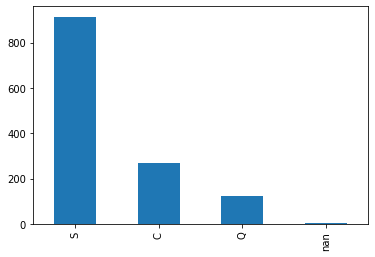
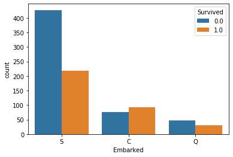
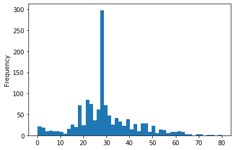

```python
from sklearn.metrics import accuracy_score, precision_score, recall_score,f1_score
from sklearn.metrics import confusion_matrix, classification_report
from sklearn.ensemble import GradientBoostingClassifier
gbc=GradientBoostingClassifier()
from sklearn.ensemble import RandomForestClassifier
r=RandomForestClassifier()
from sklearn.tree import DecisionTreeClassifier
d=DecisionTreeClassifier()
from sklearn.linear_model import LogisticRegression
log=LogisticRegression()
from sklearn .neighbors import KNeighborsClassifier
k=KNeighborsClassifier()
from sklearn.naive_bayes import GaussianNB
from sklearn.naive_bayes import BernoulliNB
g=GaussianNB()
b=BernoulliNB()
from xgboost import XGBClassifier
xgbc=XGBClassifier()
```


```python
import pandas as pd
import matplotlib.pyplot as plt
%matplotlib inline
import seaborn as sns
```


```python
df1=pd.read_csv("train.csv")
```


```python
df1.shape
```


    (891, 12)


```python
df2=pd.read_csv("test.csv")
```


```python
df2.shape # test dosyasında hayatta kalanlar yok çünkü bunları tahmin edeceğiz
```


    (418, 11)


```python
df=df1.append(df2) # iki dataframe birleştirdik 
```


```python
df.shape
```


    (1309, 12)


```python
df.isnull().sum()
```


    PassengerId       0
    Survived        418
    Pclass            0
    Name              0
    Sex               0
    Age             263
    SibSp             0
    Parch             0
    Ticket            0
    Fare              1
    Cabin          1014
    Embarked          2
    dtype: int64


```python
df.Embarked.value_counts() # hangi limandan kaç kişi binmiş
```


    S    914
    C    270
    Q    123
    Name: Embarked, dtype: int64


```python
df.Embarked.value_counts(normalize=True) # limandan binenlerin yüzdesini gösterir
```


    S    0.699311
    C    0.206580
    Q    0.094109
    Name: Embarked, dtype: float64


```python
df["Name"]
```


    0                                Braund, Mr. Owen Harris
    1      Cumings, Mrs. John Bradley (Florence Briggs Th...
    2                                 Heikkinen, Miss. Laina
    3           Futrelle, Mrs. Jacques Heath (Lily May Peel)
    4                               Allen, Mr. William Henry
                                 ...                        
    413                                   Spector, Mr. Woolf
    414                         Oliva y Ocana, Dona. Fermina
    415                         Saether, Mr. Simon Sivertsen
    416                                  Ware, Mr. Frederick
    417                             Peter, Master. Michael J
    Name: Name, Length: 1309, dtype: object


```python
df["Title"]=df["Name"].str.extract(" ([A-Za-z]+)\.",expand=False) # isimlerin içindeki harf dışında olan karakterleri çıkarıyoruz
df["Title"].value_counts()
```


    Mr          757
    Miss        260
    Mrs         197
    Master       61
    Dr            8
    Rev           8
    Col           4
    Major         2
    Mlle          2
    Ms            2
    Capt          1
    Sir           1
    Mme           1
    Jonkheer      1
    Dona          1
    Lady          1
    Countess      1
    Don           1
    Name: Title, dtype: int64


```python
df["Title"]=df["Title"].replace(["Ms","Mlle"],"Miss")
df["Title"]=df["Title"].replace(["Mme","Countess","Lady","Dona"],"Mrs")
df["Title"]=df["Title"].replace(["Dr","Major","Col","Sir","Rev","Jonkheer","Capt","Don"],"Mr")
# bilet görevlisinin yanlış yazmış olabileceği isimleri muhtemel tahmin yaparak atadık. örneğin Ms yazılmış ama miss içine aldık bunu
```


```python
df["Title"].unique() # başlıkta bulununan isimlere baktık
```


    array(['Mr', 'Mrs', 'Miss', 'Master'], dtype=object)


```python
df.info()
```

    <class 'pandas.core.frame.DataFrame'>
    Int64Index: 1309 entries, 0 to 417
    Data columns (total 13 columns):
     #   Column       Non-Null Count  Dtype  
    ---  ------       --------------  -----  
     0   PassengerId  1309 non-null   int64  
     1   Survived     891 non-null    float64
     2   Pclass       1309 non-null   int64  
     3   Name         1309 non-null   object 
     4   Sex          1309 non-null   object 
     5   Age          1046 non-null   float64
     6   SibSp        1309 non-null   int64  
     7   Parch        1309 non-null   int64  
     8   Ticket       1309 non-null   object 
     9   Fare         1308 non-null   float64
     10  Cabin        295 non-null    object 
     11  Embarked     1307 non-null   object 
     12  Title        1309 non-null   object 
    dtypes: float64(3), int64(4), object(6)
    memory usage: 143.2+ KB
    


```python
del df["Cabin"] # cabin verisi az olduğu için onu sildik
```


```python
df["Fare"].fillna(df["Fare"].mean(),inplace=True) # Fare bölümünde 1 eksik veriyi ortalama veri ile doldurduk
# " fillna " boşlukları doldur demek
```


```python
df["Age"].fillna(df["Age"].median(),inplace=True) # age kısmındaki eksik veriyi ortalama veri ile doldurduk
```


```python
df["Family"]=df["SibSp"]+df["Parch"]+1
```


```python
df.Embarked.value_counts(dropna=False).plot(kind="bar"); # hangi istasyondan kaç kişi binmiş
```





```python
df["Embarked"]=df["Embarked"].fillna("S") # boş veriyi en çok istasyona atadık
```


```python
sns.countplot(x="Embarked",hue="Survived",data=df);
```





```python
df.Age.plot(kind="hist",bins=50);
```





```python
df.Family.value_counts() # bir ailenin kaç kişi olduğunu gösterir örneğin 7 kişilik 16 aile varmış
```


    1     790
    2     235
    3     159
    4      43
    6      25
    5      22
    7      16
    11     11
    8       8
    Name: Family, dtype: int64


```python
df["Single"]=df.Family<2
df["Small"]=(df.Family>1)&(df.Family<5)
df["Medium"]=(df.Family>4)&(df.Family<7)
df["Large"]=(df.Family>6)
# aile sayısına göre grup oluşturduk
```


```python
df.drop(["PassengerId","Ticket"],axis=1,inplace=True) # bilet numarsı vb. işimize yaramaycağını düşündük sildik
```


```python
df_dummies=pd.get_dummies(df,drop_first=True) # string değerleri sayısal değişken olarak tutuyoruz
```


```python
df_train=df_dummies[:891]
df_test=df_dummies[891:] # veriyi tekrar böldük bir kısmını test için ayırdık
```


```python
df_train.shape,df_test.shape
```


    ((891, 1323), (418, 1323))


```python
del df_train["Survived"]
```


```python
y=df1["Survived"]
```


```python
algorithms=[g,b,k,log,gbc,r,d,xgbc]
names=["GaussianNB","BernoulliNB","K Nearest","Logistic","GradientBoosting","RandomForest","Decision Tree","Xgbc"]
```


```python
def algo_test(X,y,algorithms=algorithms,names=names):
    for i in range(len(algorithms)):
        algorithms[i]=algorithms[i].fit(X,y)
    
    accuracy=[]
    precision=[]
    recall=[]
    f1=[]
    for i in range(len(algorithms)):
        accuracy.append(accuracy_score(y,algorithms[i].predict(X)))
        precision.append(precision_score(y,algorithms[i].predict(X)))
        recall.append(recall_score(y,algorithms[i].predict(X)))
        f1.append(f1_score(y,algorithms[i].predict(X)))
    metrics=pd.DataFrame(columns=["Accuracy","Precision","Recall","F1"],index=names)
    metrics["Accuracy"]=accuracy
    metrics["Precision"]=precision
    metrics["Recall"]=recall
    metrics["F1"]=f1
    return metrics.sort_values("F1",ascending=False)    
# bir çok tahmin algoritmasını bir arada kullanabileceğimiz bir fonksiyon yazdık
```


```python
algo_test(df_train,y)
# aşağıda tahmni sonuçlarını görüyoruz
```

    D:\programlar\anaconda\lib\site-packages\sklearn\linear_model\_logistic.py:940: ConvergenceWarning: lbfgs failed to converge (status=1):
    STOP: TOTAL NO. of ITERATIONS REACHED LIMIT.
    
    Increase the number of iterations (max_iter) or scale the data as shown in:
        https://scikit-learn.org/stable/modules/preprocessing.html
    Please also refer to the documentation for alternative solver options:
        https://scikit-learn.org/stable/modules/linear_model.html#logistic-regression
      extra_warning_msg=_LOGISTIC_SOLVER_CONVERGENCE_MSG)
    D:\programlar\anaconda\lib\site-packages\xgboost\sklearn.py:888: UserWarning: The use of label encoder in XGBClassifier is deprecated and will be removed in a future release. To remove this warning, do the following: 1) Pass option use_label_encoder=False when constructing XGBClassifier object; and 2) Encode your labels (y) as integers starting with 0, i.e. 0, 1, 2, ..., [num_class - 1].
      warnings.warn(label_encoder_deprecation_msg, UserWarning)
    

    [21:01:12] WARNING: C:/Users/Administrator/workspace/xgboost-win64_release_1.3.0/src/learner.cc:1061: Starting in XGBoost 1.3.0, the default evaluation metric used with the objective 'binary:logistic' was changed from 'error' to 'logloss'. Explicitly set eval_metric if you'd like to restore the old behavior.
    


<div>
<style scoped>
    .dataframe tbody tr th:only-of-type {
        vertical-align: middle;
    }

    .dataframe tbody tr th {
        vertical-align: top;
    }

    .dataframe thead th {
        text-align: right;
    }
</style>
<table border="1" class="dataframe">
  <thead>
    <tr style="text-align: right;">
      <th></th>
      <th>Accuracy</th>
      <th>Precision</th>
      <th>Recall</th>
      <th>F1</th>
    </tr>
  </thead>
  <tbody>
    <tr>
      <th>RandomForest</th>
      <td>1.000000</td>
      <td>1.000000</td>
      <td>1.000000</td>
      <td>1.000000</td>
    </tr>
    <tr>
      <th>Decision Tree</th>
      <td>1.000000</td>
      <td>1.000000</td>
      <td>1.000000</td>
      <td>1.000000</td>
    </tr>
    <tr>
      <th>GaussianNB</th>
      <td>0.998878</td>
      <td>0.997085</td>
      <td>1.000000</td>
      <td>0.998540</td>
    </tr>
    <tr>
      <th>Xgbc</th>
      <td>0.965208</td>
      <td>0.969789</td>
      <td>0.938596</td>
      <td>0.953938</td>
    </tr>
    <tr>
      <th>Logistic</th>
      <td>0.856341</td>
      <td>0.845161</td>
      <td>0.766082</td>
      <td>0.803681</td>
    </tr>
    <tr>
      <th>GradientBoosting</th>
      <td>0.846240</td>
      <td>0.833876</td>
      <td>0.748538</td>
      <td>0.788906</td>
    </tr>
    <tr>
      <th>BernoulliNB</th>
      <td>0.810325</td>
      <td>0.758209</td>
      <td>0.742690</td>
      <td>0.750369</td>
    </tr>
    <tr>
      <th>K Nearest</th>
      <td>0.812570</td>
      <td>0.783172</td>
      <td>0.707602</td>
      <td>0.743472</td>
    </tr>
  </tbody>
</table>
</div>


```python
df_train.isnull().sum()
```


    Pclass        0
    Age           0
    SibSp         0
    Parch         0
    Fare          0
                 ..
    Embarked_Q    0
    Embarked_S    0
    Title_Miss    0
    Title_Mr      0
    Title_Mrs     0
    Length: 1322, dtype: int64


```python
del df_test["Survived"]
```


```python
tahmin=k.predict(df_test)
```


```python
tahmin
```


    array([0, 0, 0, 0, 1, 0, 0, 0, 1, 0, 0, 0, 1, 0, 1, 1, 0, 1, 1, 1, 0, 1,
           1, 1, 1, 0, 1, 1, 1, 0, 0, 0, 1, 0, 1, 0, 0, 0, 0, 1, 0, 1, 0, 1,
           1, 0, 0, 0, 1, 1, 0, 0, 1, 1, 0, 0, 0, 0, 0, 1, 0, 0, 0, 1, 1, 1,
           1, 0, 0, 1, 1, 0, 0, 0, 1, 1, 0, 1, 0, 1, 1, 0, 1, 0, 0, 0, 1, 0,
           1, 1, 1, 0, 1, 0, 1, 0, 1, 0, 0, 0, 1, 0, 0, 0, 1, 0, 0, 0, 0, 0,
           0, 1, 1, 1, 1, 0, 0, 1, 1, 1, 1, 0, 1, 0, 0, 1, 0, 1, 0, 0, 0, 0,
           0, 0, 0, 0, 1, 0, 0, 0, 0, 1, 0, 0, 1, 0, 0, 0, 1, 0, 1, 0, 0, 0,
           0, 0, 1, 0, 1, 1, 1, 1, 1, 0, 0, 0, 0, 0, 1, 0, 0, 1, 0, 0, 0, 1,
           1, 0, 1, 1, 0, 1, 1, 0, 1, 0, 1, 0, 0, 0, 0, 0, 1, 0, 1, 0, 1, 0,
           0, 0, 1, 1, 0, 1, 0, 0, 0, 0, 1, 0, 0, 0, 0, 1, 0, 0, 1, 0, 1, 0,
           1, 0, 1, 0, 1, 0, 0, 1, 0, 0, 0, 1, 0, 0, 1, 0, 0, 1, 1, 1, 1, 1,
           0, 0, 0, 0, 1, 0, 1, 0, 1, 0, 0, 0, 0, 0, 0, 0, 1, 0, 0, 0, 1, 1,
           0, 0, 0, 0, 0, 0, 0, 0, 1, 1, 0, 1, 0, 0, 0, 0, 0, 1, 1, 0, 1, 0,
           0, 0, 0, 0, 0, 0, 0, 0, 0, 0, 1, 0, 0, 0, 0, 0, 0, 0, 1, 1, 0, 1,
           0, 0, 0, 1, 0, 0, 1, 1, 0, 0, 0, 0, 0, 0, 0, 1, 1, 0, 1, 0, 0, 0,
           1, 0, 0, 1, 0, 0, 1, 0, 0, 1, 0, 0, 0, 1, 0, 1, 0, 0, 0, 1, 1, 0,
           0, 0, 1, 0, 1, 0, 0, 1, 0, 1, 1, 0, 1, 0, 0, 0, 1, 1, 0, 1, 0, 0,
           1, 1, 0, 0, 0, 1, 0, 0, 0, 1, 0, 1, 0, 0, 0, 0, 0, 1, 1, 0, 0, 1,
           0, 1, 0, 0, 1, 0, 1, 0, 0, 0, 0, 0, 1, 1, 1, 1, 0, 0, 1, 0, 0, 1],
          dtype=int64)


```python
sonuc=df2[["PassengerId"]]
```


```python
sonuc["Survived"]=tahmin
```

    D:\programlar\anaconda\lib\site-packages\ipykernel_launcher.py:1: SettingWithCopyWarning: 
    A value is trying to be set on a copy of a slice from a DataFrame.
    Try using .loc[row_indexer,col_indexer] = value instead
    
    See the caveats in the documentation: https://pandas.pydata.org/pandas-docs/stable/user_guide/indexing.html#returning-a-view-versus-a-copy
      """Entry point for launching an IPython kernel.
    


```python
sonuc.head()
```


<div>
<style scoped>
    .dataframe tbody tr th:only-of-type {
        vertical-align: middle;
    }

    .dataframe tbody tr th {
        vertical-align: top;
    }

    .dataframe thead th {
        text-align: right;
    }
</style>
<table border="1" class="dataframe">
  <thead>
    <tr style="text-align: right;">
      <th></th>
      <th>PassengerId</th>
      <th>Survived</th>
    </tr>
  </thead>
  <tbody>
    <tr>
      <th>0</th>
      <td>892</td>
      <td>0</td>
    </tr>
    <tr>
      <th>1</th>
      <td>893</td>
      <td>1</td>
    </tr>
    <tr>
      <th>2</th>
      <td>894</td>
      <td>1</td>
    </tr>
    <tr>
      <th>3</th>
      <td>895</td>
      <td>1</td>
    </tr>
    <tr>
      <th>4</th>
      <td>896</td>
      <td>1</td>
    </tr>
  </tbody>
</table>
</div>


```python
sonuc.to_csv("sonuc.csv",index=False)
# bulduğumuz tahminleri csv formatında kaydettik ve kaggle dan sonuca baktık %78 doğruluk oranı aldık
```


```python

```
